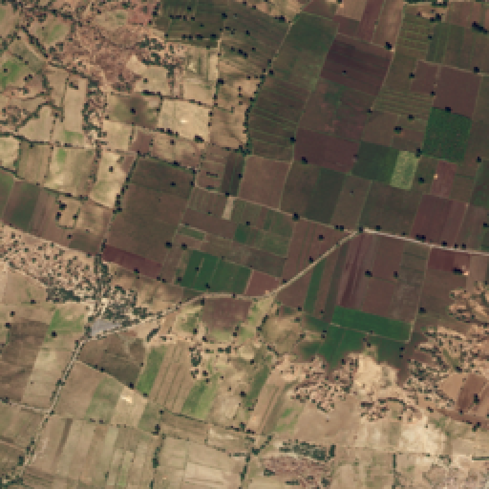
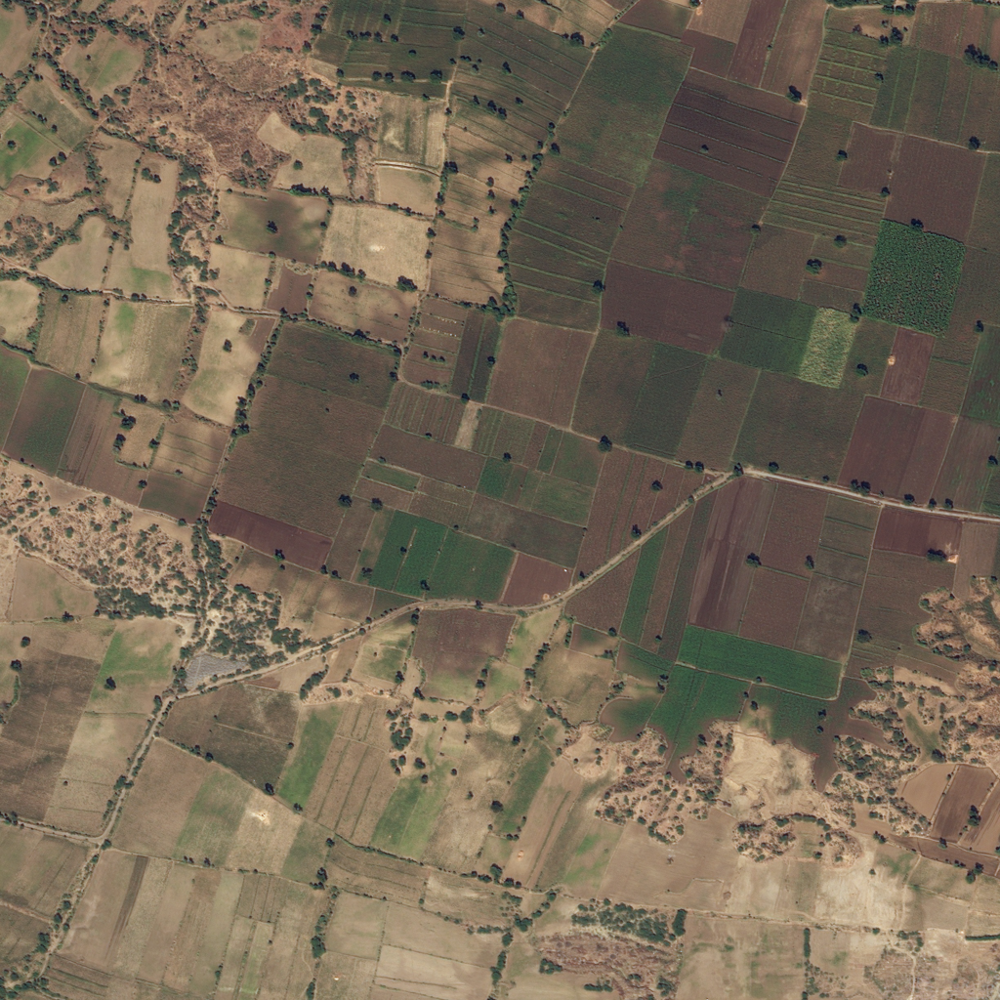
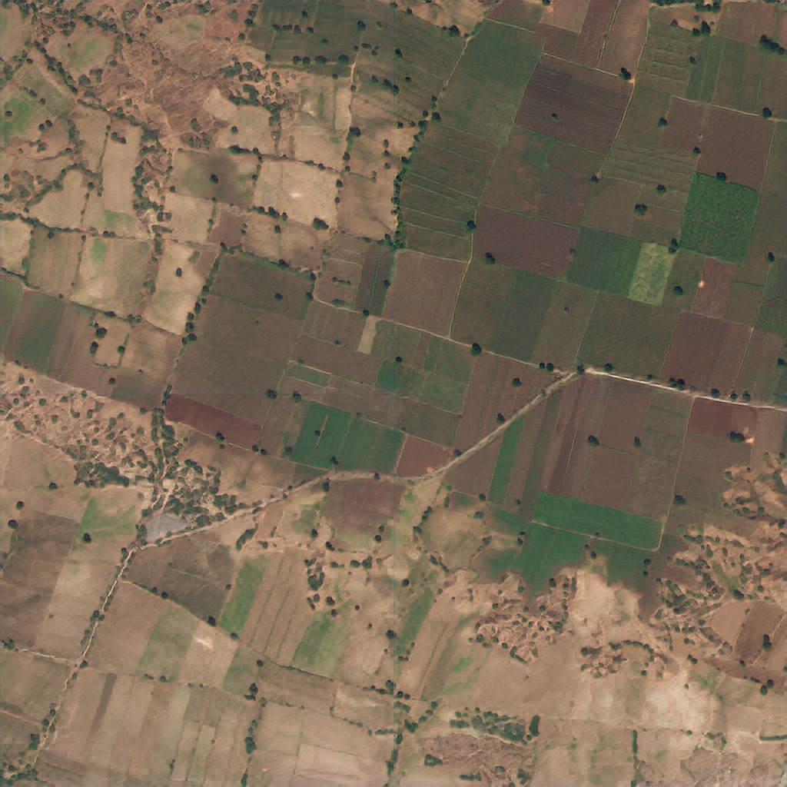
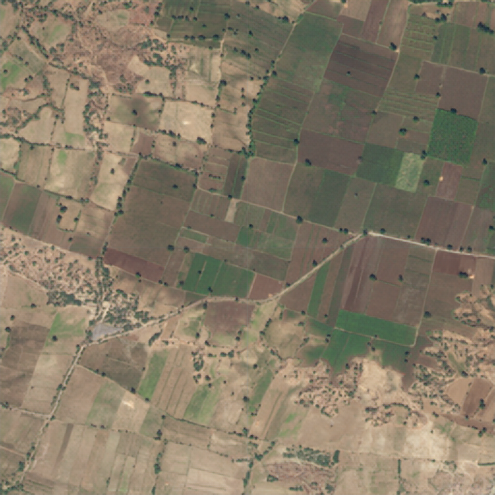

# crossSRGAN

## Abstract
crossSRGAN can generate better realistic images than SRGAN under certain condition.
The loss function of crossSRGAN is different from that of SRGAN.
This is because the generator and the discriminator have a more adversarial relationship.

<table>
   <tr>
    <td></td>
    <td></td>
   </tr>
   <tr>
    <td align="center">input</td>
    <td align="center">ground truth</td>
   </tr>
   <tr>
    <td></td>
    <td></td>
   </tr>
   <tr>
    <td align="center">output crossSRGAN</td>
    <td align="center">output SRGAN</td>
   </tr>
  </table>

## Dataset Preparation  
dataset : https://www.kaggle.com/balraj98/deepglobe-road-extraction-dataset?select=train
- recommendation  
&emsp; image-size : 1024x1024  
&emsp; number of images : 1100  
&emsp; epoch : 2

